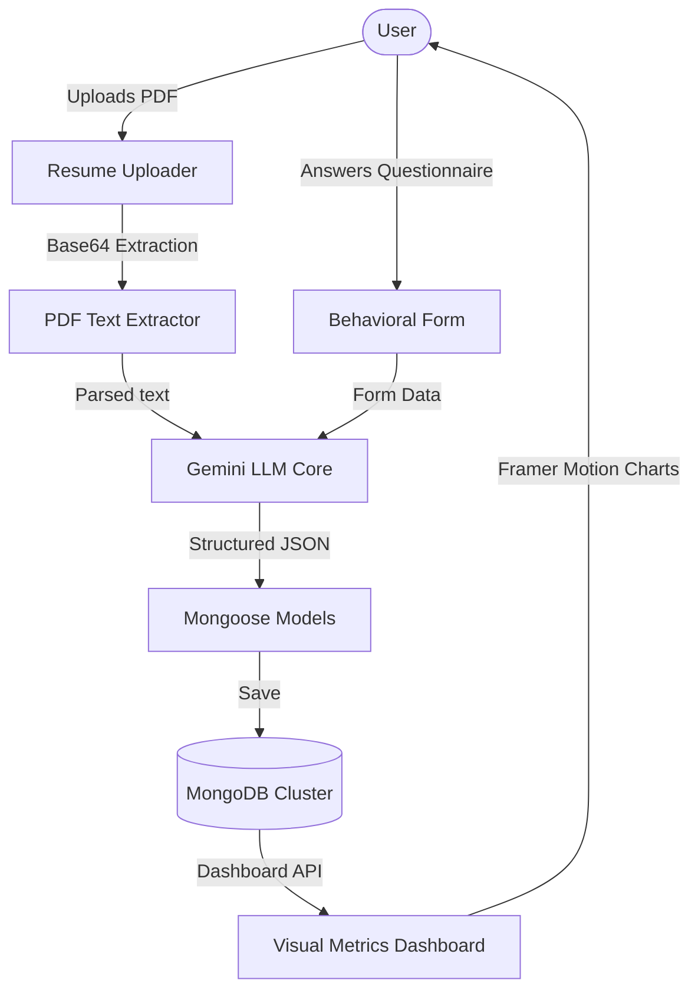

# Rezumix Project Architecture

Welcome to the technical architecture guide for **Rezumix**. This document details the architectural layout, pipeline processing flow, database schemas, and AI integration mechanisms of the platform.

---

## 🏗️ System Overview

Rezumix is built on the **Next.js App Router** framework using **React** and **Mongoose/MongoDB**. It serves as an AI-powered analyzer that processes candidate resumes (PDFs) and personality questionnaires to predict Big Five personality traits using the Google Gemini API.

---

## 🗂️ Key Component Architecture

### 1. Data Pipeline
- **Resume Extraction**: Evaluates PDF text contents on the client-side (`extractPdfText.js`) and converts files to structured text streams.
- **AI Processing Layer**: Sends context-specific prompts (predefined personality matrices) to Gemini model endpoints, enforcing strict JSON structures.
- **Persistence Layer**: Mongoose schemas map user IDs to corresponding reports, caching results for instant rendering.

### 2. Database Models
- **UserModel**: Handles credentials, password hashing, and active user profile attributes.
- **ResumeModel**: Stores historical data of analyzed resumes, match scores, and parsed skillsets.
- **MockInterviewModel / SkillGapModel**: Contains specific interview records, feedback strings, and recommended career trajectories.

---

## 🔒 Security Design

- **JWT Session Tokens**: Stored exclusively inside `HTTP-Only` cookies to mitigate Cross-Site Scripting (XSS) risks.
- **Input Sanitization**: Utility validators sanitize and escape structural text before passing requests to Mongoose queries or AI inputs.
